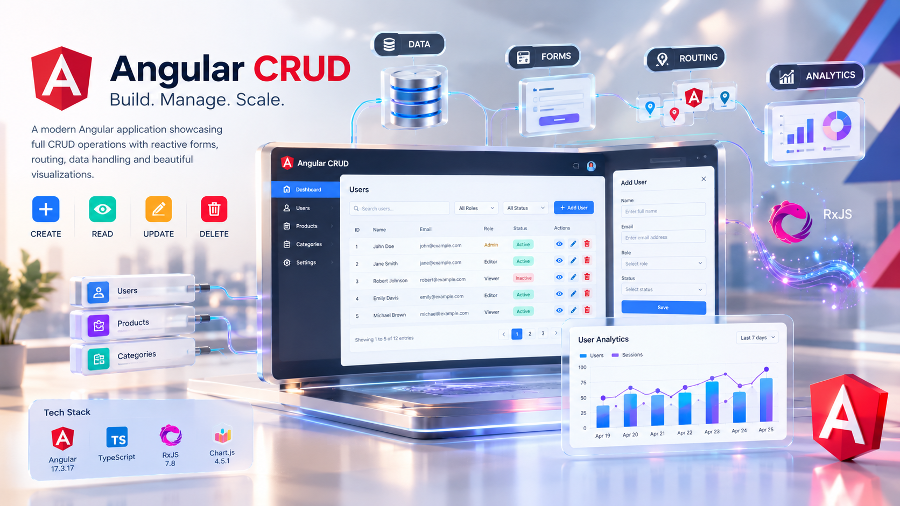

# Angular CRUD — Employee Management SPA

A single-page application built with **Angular 17** (standalone components) that
demonstrates full **CRUD** (Create, Read, Update, Delete) operations on an
in-browser "Employees" dataset, along with a few supporting features such as
search, filtering, sorting, pagination, CSV export, a read-only table view,
a basic analytics page, and an internal mail composer.

This project was originally generated with the
[Angular CLI](https://github.com/angular/angular-cli) (v17.3.17) and was later
extended into a small employee-management dashboard.

## Getting started

Prerequisites: [Node.js](https://nodejs.org/) (LTS) and the Angular CLI
(`npm install -g @angular/cli`).

```bash
npm install   # install dependencies
ng serve      # start the dev server
```

Open `http://localhost:4200/`. Any non-empty username/password that passes
validation takes you to `/home` — there's no real backend behind it.

## Live features at a glance

- Login screen (client-side form validation, no real auth backend)
- Employee dashboard: create, read/search/filter/sort/paginate, update, and
  delete employees (plus bulk "deactivate" and CSV export)
- Columnar/table view and a basic analytics view of the same dataset
- Internal mail composer (send a message to selected employees)
- Data persistence via the browser's `localStorage` (no server/database required)

## Tech stack

- Angular 17 (standalone components, no `NgModule` needed)
- TypeScript
- Angular Router for navigation
- `FormsModule` for template-driven forms and two-way binding
- Plain CSS per component (no UI framework)
- `localStorage` as the persistence layer (acts as a mock database)

## Browser support

Since all data lives in `localStorage`, the app requires a modern evergreen
browser with `localStorage` enabled:

- Chrome, Edge, Firefox, and Safari (latest two major versions)
- JavaScript and `localStorage` must be enabled (no incognito/private
  restrictions that block storage)
- Clearing site data/cache will reset the seeded employee dataset back to
  the original 10 sample records
- No Internet Explorer support (Angular 17 does not target it)

## Project structure

```
src/app/
├── app.component.ts   # Root component (router outlet host)
├── app.routes.ts      # Route definitions
├── app.config.ts      # Application-wide providers
├── login/             # Login screen
├── home/              # Main CRUD dashboard (employees)
├── view/              # Read-only columnar/table view
├── analysis/          # Basic analytics/summary view
└── mail/              # Internal mail composer
```

## Data model

Each employee record follows the `Emp` type defined in
`src/app/home/home.component.ts`:

```ts
type Emp = {
  id: number; name: string; email: string;
  department: string; role: string; location: string; team: string;
  manager?: boolean; active?: boolean;
};
```

The app ships with 10 seeded sample employees the first time it runs (no
saved data yet in `localStorage`); after that, every create/update/delete
operation reads from and writes back to the same `localStorage` record.

## CRUD implementation details

All CRUD operations live in `src/app/home/home.component.ts` and operate on an
in-memory `employees` array of type `Emp`, which is synced to `localStorage`
under the key `employees` on every mutation (see `save()`). On startup
(`ngOnInit`), the component loads existing data from `localStorage`, or seeds
it with a default dataset of 10 sample employees the first time the app runs.

### Create
`openModal('add')` opens the "Add Employee" modal, pre-filled with sensible
defaults. `addEmployeeConfirm()` validates that `name`/`email` are present,
generates the next numeric `id`, pushes the new employee into the array,
refreshes filter dropdown values, persists to `localStorage`, and re-applies
the current search/filter/sort/pagination state.

### Read
`apply()` computes the currently visible employees by combining free-text
`searchTerm` (name/email), column filters (department, role, location,
team), a single-column sort (`sortBy`), and pagination (`page`/`pageSize`).
The **Home** dashboard renders each visible employee as a card
(`displayedEmployees`) with live stats. **View** and **Analysis** offer
read-only/summary views of the same dataset, and `exportCsv()` lets the
user download the full list as a `.csv` file.

### Update
`openModal('edit', employee)` opens the "Edit Employee" modal, pre-filled
with the selected record's fields. `editEmployeeConfirm()` finds the
employee by `id`, merges the edits into the array (spreading the original
record to preserve fields not shown in the form, like `manager`), persists
the change, and refreshes the list.

### Delete
`openModal('delete', employee)` opens a confirmation modal for a single
employee; `deleteEmployeeConfirm()` permanently removes it by `id` and
refreshes filters/list. `openModal('deactivateConfirm')` +
`bulkDeactivateConfirm()` provide a bulk, non-destructive alternative that
sets `active = false` for every employee currently visible on the page.

### Persistence layer
Because this is a front-end-only demo project, there is no backend/database
— `localStorage` plays that role, storing `employees` (the full dataset) and
`sentMails` (mail history). This keeps CRUD fully functional across page
reloads without a server, while remaining easy to swap for a real HTTP API
later (e.g., replacing `save()`/`ngOnInit()` with an `HttpClient` service).

## Supporting components

- **Login** (`login/login.component.ts`) — template-driven form (`NgForm`)
  validating non-empty username/password before navigating to `/home`; no
  backend checks credentials.
- **View** (`view/view.component.ts`) — read-only, table/columnar rendering
  of the employee list, via `@Input()` or `localStorage`, with its own
  `filtered` search getter over name/email/department.
- **Analysis** (`analysis/analysis.component.ts`) — lightweight analytics summary.
- **Mail** (`mail/mail.component.ts`) — pick recipients (`toggleRecipient`),
  write a subject/message, and send; history is stored in `localStorage`
  under `sentMails` and shown in a `sent` tab alongside placeholder
  `inbox`/`drafts`/`trash` tabs.

## Routes

| Path        | Component          | Purpose                              |
|-------------|---------------------|---------------------------------------|
| `/`         | redirects to `login`| Default route                         |
| `/login`    | `LoginComponent`     | Sign-in form                          |
| `/home`     | `HomeComponent`      | Main employee CRUD dashboard          |
| `/view`     | `ViewComponent`      | Read-only columnar view of employees  |
| `/analysis` | `AnalysisComponent`  | Basic analytics/summary               |
| `/mail`     | `MailComponent`      | Compose and send mail to employees    |

## Other CLI commands

- `ng generate component component-name` — scaffold a new component (also
  works with `directive|pipe|service|class|guard|interface|enum|module`).
- `ng build` — build the project; artifacts land in `dist/`.
- `ng test` — run unit tests via [Karma](https://karma-runner.github.io).
- `ng e2e` — run end-to-end tests (requires adding an e2e package first).

## Possible next steps

- Replace `localStorage` with a real backend (`HttpClient` + REST API).
- Add real authentication/authorization instead of the client-only login form.
- Add form validation feedback (required fields, email format) in the modals.
- Add unit tests covering the CRUD methods in `HomeComponent`.

## Troubleshooting

- **Blank page or seed data not loading** — open the browser dev tools
  console for errors; clear the `employees` key in `localStorage` and
  reload to force reseeding.
- **`ng: command not found`** — the Angular CLI isn't installed globally;
  run `npm install -g @angular/cli` or use `npx ng serve` instead.
- **Port 4200 already in use** — stop the other process or run
  `ng serve --port 4201`.
- **Changes to employee data not persisting** — check that the browser
  isn't in private/incognito mode with storage restrictions, and that
  `localStorage` hasn't been disabled via browser settings.

## Contributing

Contributions are welcome, whether it's a bug fix, a new feature, or a
documentation improvement:

1. Fork the repository and create a feature branch off `master`.
2. Make your changes, keeping components standalone and consistent with
   the existing code style.
3. Run `ng build` locally to confirm the project still compiles cleanly.
4. Commit with a clear, descriptive message and open a pull request
   describing what changed and why.
5. Keep PRs focused — one feature or fix per PR makes review easier.

## Further help

Run `ng help` or see the
[Angular CLI Overview and Command Reference](https://angular.io/cli).
